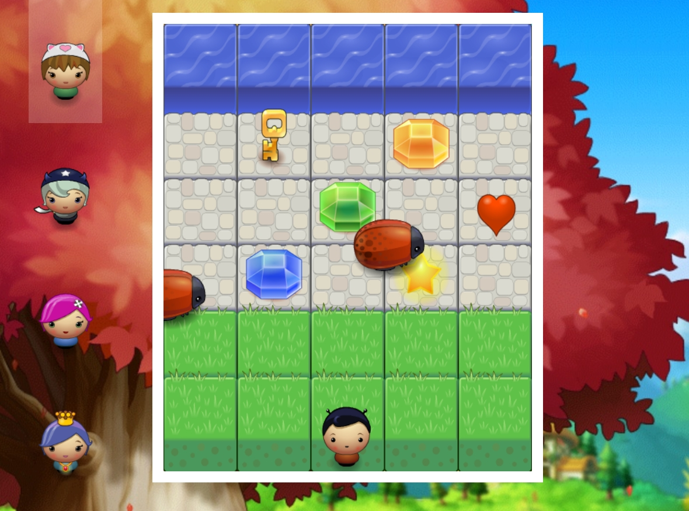

Arcade Game
===============================
<div  align="left">

</div>

# Table of Contents

* [Description](#description)
* [Run the Game](#run-the-game)
* [How To Play](#how-to-play)

## Description

* Version of Classic Arcade Game [Frogger](https://en.wikipedia.org/wiki/Frogger)
* Project created as part of the Udacity Front-End Developer Nanodegree.

## Run the Game

In order to run and play the game you can:

* Project Demo: https://moonfallmaple.github.io/arcade-game/
* Run locally by downloading, cloning or forking this project:

    ```
    $ git clone https://github.com/moonfallmaple/arcade-game
    ```

## How To Play

- In this game you have a Player and Enemies (bugs). The goal of the player is to reach the water. Player has **3 times** chance to collide into any one of the enemies. If exceed 3 times game over. 

- The user can select the image for the player character before starting the game. 
- Use the **arrow keys** on your **keyboard** to move left, right, up and down
- Once the player collides with an enemy, the game is reset and the player moves back to the starting square
- Player can collect different items during the game.
- Once the player reaches the water (i.e., the top of the game board), the game is won


